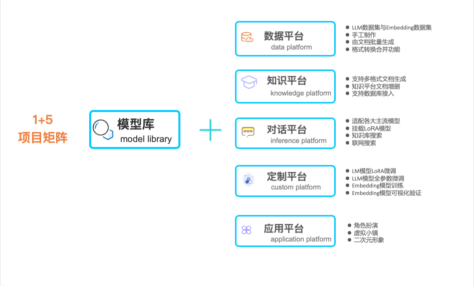

# 苏秦（suqin） 语言大模型全工具链 WebUI 整合包

[**English**](./README_EN.md) | [**中文**](https://github.com/wpydcr/LLM-Kit)

## 介绍

⛓️ 本项目目标是实现目前各大语言模型的全流程工具 WebUI 整合包。不用写代码即可拥有自己的定制模型与专属应用！

具体功能模块如下：
<p align="center">
  
</p>

---
## 开发部署

初次使用建议查阅[说明文档](https://www.yuque.com/setpath/llm-kit)进行相关操作

### 软件需求
本项目已在 Python 3.8 - 3.10，CUDA 11.7/11.8 环境下完成测试。已在 Windows、Linux 系统中完成测试。

### 安装环境

#### 1. 运行环境

```shell
# 拉取仓库
$ git clone https://github.com/wpydcr/LLM-Kit.git

# 进入目录
$ cd LLM-Kit

# 安装依赖
$ pip install -r requirements.txt
```
 依赖也可以直接下载：[Windows环境包](https://pan.baidu.com/s/1NVmXam5MGfSn3MkZlt0zQg?pwd=8ku6)， [Linux环境包](https://pan.baidu.com/s/1exSZYLSx0OWP5NXNwtZsCw?pwd=fhn0)。
 
 [显卡驱动](https://www.nvidia.cn/Download/index.aspx?lang=cn)和[cuda](https://developer.nvidia.com/cuda-toolkit-archive)自行安装

#### 2. 执行脚本

+ win环境，双击打开 web-demo-CN.bat 脚本
+ Linux环境，双击打开 web-demo-CN.sh 脚本

#### 3. 相关演示文件

+ 体验大模型连接数据库功能请先下载[相关文件](https://pan.baidu.com/s/13EWleDUaqHY7JeyfY0ErDQ?pwd=bjnp)
+ 体验角色扮演功能请先下载[相关文件](https://pan.baidu.com/s/13eWB-HMay7g9BSMIuZc8JQ?pwd=h9hq)
+ 表情包功能请先下载[相关文件](https://pan.baidu.com/s/1W2Rwq6Ies4VRxY7wsgkNVQ?pwd=lxmm)放入data/apply/emotion文件夹中

---

## 文件目录

- **env** ：集成包环境
- **utils** ：工具代码
- **modules** ：各模块代码
  - **agent** ：agent相关代码
    - **chatdb** : 数据库接入相关代码
    - **svc** : svc相关代码
    - **vits** : vits相关代码
  - **apply** ：应用demo代码
  - **model** ：模型相关代码
- **data** ：数据文件
  - **apply** ：应用demo相关文件
    - **audio** ：生成的语音文件
    - **emotion** ：表情包文件
    - **play** ：人设提示词文件
  - **documents** ：知识库数据文件
  - **modeldata** ：模型训练数据文件
    - **LLM** ：大模型训练数据文件
    - **Embedding** ：嵌入模型训练数据文件
- **ui** ：ui界面代码
- **output** ：训练中的checkpoints
- **models** ：模型文件
  - **LLM** ：语言大模型文件
  - **Embedding** ：嵌入模型文件
  - **LoRA** ：LoRA模型文件
  - **live2d_models** ：[live2d模型文件](https://www.live2d.com/en/download/sample-data/)
  - **svc_models** ：svc相关文件
    - **hubert_model** ：[声音编码器模型文件](https://github.com/bshall/hubert/releases/download/v0.1/hubert-soft-0d54a1f4.pt)
    -  **svc** : svc模型文件
  - **vits_pretrained_models** : [vits模型文件]((https://huggingface.co/spaces/zomehwh/vits-models/tree/main/pretrained_models))

---

## 发展路线图

- [x] LLM API支持(无需显卡)
  - [x] [openai(支持国内中转)](https://platform.openai.com/account/api-keys)
  - [x] [azure openai](https://learn.microsoft.com/zh-cn/azure/cognitive-services/openai/)
  - [x] [文心一言](https://cloud.baidu.com/survey_summit/qianfan.html)
  - [x] [智谱GLM](https://open.bigmodel.cn/usercenter/apikeys)
  - [x] [通义千问](https://help.aliyun.com/document_detail/2399480.html)
  - [x] [讯飞星火](https://console.xfyun.cn/services/cbm)
  - [x] [claude](https://www.anthropic.com/index/claude-2)  
- [ ] LLM 模型支持(训练/推理)
  - [x] [4bit与8bit量化（bitsandbytes仅支持linux）](https://github.com/TimDettmers/bitsandbytes)
  - [x] [使用内存替代部分显存（deepspeed训练仅支持linux，推理在windows需编译）](https://github.com/microsoft/DeepSpeed)
  - [x] [chatglm-6b](https://huggingface.co/THUDM/chatglm-6b)
  - [x] [chatglm2-6b](https://huggingface.co/THUDM/chatglm2-6b)
  - [x] [chatglm2-6b-32k](https://huggingface.co/THUDM/chatglm2-6b-32k)
  - [x] [moss-moon-003-sft](https://huggingface.co/fnlp/moss-moon-003-sft)
  - [x] [phoenix-chat-7b](https://huggingface.co/FreedomIntelligence/phoenix-chat-7b)
  - [x] [Guanaco](https://huggingface.co/JosephusCheung/Guanaco)
  - [x] [baichuan-vicuna-chinese-7b](https://huggingface.co/fireballoon/baichuan-vicuna-chinese-7b)
  - [x] [Baichuan-13B-Chat](https://huggingface.co/baichuan-inc/Baichuan-13B-Chat)
  - [x] [internlm-chat-7b-8k](https://huggingface.co/internlm/internlm-chat-7b-8k)
  - [x] [chinese-alpaca-2-7b(llama2)](https://huggingface.co/ziqingyang/chinese-alpaca-2-7b)
  - [x] [Qwen-7B-Chat](https://huggingface.co/Qwen/Qwen-7B-Chat)
  - [x] [Qwen-14B-Chat](https://huggingface.co/Qwen/Qwen-14B-Chat)
  - [x] [Baichuan2-7B-Chat](https://huggingface.co/baichuan-inc/Baichuan2-7B-Chat)  
  - [x] [Baichuan2-13B-Chat](https://huggingface.co/baichuan-inc/Baichuan2-13B-Chat)
- [ ] 多模态大模型(推理)
  - [ ] qwen-vl
- [x]  Finetune 支持
  - [x] [LoRA](https://github.com/tloen/alpaca-lora)
  - [x] <del>[P-Tuning](https://github.com/THUDM/ChatGLM-6B/tree/main/ptuning)<del>
  - [x] 全参数微调
- [x] Embedding 模型支持(训练，推理:HuggingFaceEmbeddings能加载的都行)
  - [x] [BERT,SENTENCEBERT,COSENT架构的模型](https://github.com/shibing624/text2vec#evaluation)
    - [x] [shibing624/text2vec-base-chinese](https://huggingface.co/shibing624/text2vec-base-chinese)
    - [x] [bert-base-uncased](https://huggingface.co/bert-base-uncased)
    - [x] [paraphrase-multilingual-MiniLM-L12-v2](https://huggingface.co/sentence-transformers/paraphrase-multilingual-MiniLM-L12-v2)
- [ ] 工具
  - [ ] 聊天
    - [X] LLM API 并行调用
    - [X] LLM API 流式调用
    - [x] 提示词模板
  - [ ] 图像生成
    - [x] [Midjourney(VPN)](https://github.com/CelestialRipple/Midjourney-Web-API)
    - [ ] GEN-2
    - [ ] Pika
  - [ ] 数据集
    - [x] LLM训练数据集制作
    - [x] Embedding训练数据集制作
    - [x] LLM数据集格式转换
    - [x] Embedding数据集格式转换
  - [ ] langchain
    - [x] 本地知识库
      - [x] FAISS
      - [X] 本地模型知识库并行调用
    - [x] 网络接入
    - [x] [mysql数据库接入](https://github.com/huchenxucs/ChatDB)
    - [x] Agent 实现
  - [ ] 扩展插件模式
- [ ] 应用demo
    - [x] 角色扮演
        - [x] 记忆库
        - [x] 背景库
        - [x] 人设提示词
        - [x] [时间感知](https://github.com/Syan-Lin/CyberWaifu)
        - [x] [表情包](https://pan.baidu.com/s/1W2Rwq6Ies4VRxY7wsgkNVQ?pwd=lxmm)
    - [ ] AI 智能体
        - [ ] 单智能体设计
        - [ ] 场景设定
        - [ ] 智能体交互
        - [ ] 可视化
    - [ ] 人物形象
        - [ ] 声音
            - [x] [在线tts](https://yntts.qq.com/)
            - [X] [本地tts](https://github.com/jackiexiao/zhtts)
            - [X] [vits 调用](https://huggingface.co/spaces/zomehwh/vits-models/tree/main/pretrained_models)
            - [ ] [vits 训练](https://github.com/SayaSS/vits-finetuning)
            - [X] [svc 调用](https://github.com/LC1332/Chat-Haruhi-Suzumiya)
            - [ ] [svc 训练](https://github.com/svc-develop-team/so-vits-svc)
        - [ ] [live2D](https://www.live2d.com/en/download/sample-data/)
          - [x] 嘴型
          - [X] live2d 场景自定义 
          - [ ] 表情
          - [ ] 动作
        - [ ] 真人
          - [ ] 嘴型
          - [ ] 表情
          - [ ] 动作
          - [ ] 场景
          
- [ ] 增加 API 支持
  - [ ] 利用 fastapi 实现 API 部署方式
  - [ ] 实现调用 API 的 Web UI Demo
  - [ ] VUE 页面前端

---

## 贡献者

### [吴平宇 @君材数云](https://github.com/wpydcr)
发起人，负责整体项目架构和技术规划

### [廖文彬 @中科院计算技术研究所](https://github.com/set-path)
负责gradio，图向量数据库，Mysql数据库，api接口集成等python开发

### [胡钜程 @伦敦大学学院UCL](https://github.com/smgjch)
负责图向量数据库， live2D，vits, svc，gradio等python开发

### [李璟辉](https://github.com/JaheimLee)
负责大模型训练与推理的后端代码开发

### [李禹含 @灵境赛博](https://github.com/liyuhan3035)
负责提示词，嵌入模型验证和推理的后端代码开发

### [从灿](https://github.com/Alan-2018)
负责嵌入模型训练的后端代码开发

---

## 项目招募

详见[说明文档](https://www.yuque.com/setpath/llm-kit/gf3hu8l2bys1pgfd)

---

## 参考与学习

  [基于ChatGLM的langchain应用](https://github.com/imClumsyPanda/langchain-ChatGLM)

  [骆驼中文大模型](https://github.com/LC1332/Luotuo-Chinese-LLM)

 [ChatDB](https://github.com/huchenxucs/ChatDB)

  [Live2d模型](https://github.com/nladuo/live2d-chatbot-demo)

 [Chat-Haruhi-Suzumiya](https://github.com/LC1332/Chat-Haruhi-Suzumiya)

 [川虎Chat：为多种LLM提供Web图形界面](https://github.com/GaiZhenbiao/ChuanhuChatGPT)

---

## 开源协议
本仓库的代码依照 [AGPL-3.0](https://www.gnu.org/licenses/agpl-3.0.en.html) 协议开源

一方面希望通过开源加强项目产品化程度；另一方面希望在社区中吸收更多的实践场景进而继续完善产品，也欢迎大家参与到项目中来。

AGPL-3.0 是 OSI 批准的许可证，符合自由和开源软件的所有标准，开源永远是我们的初心与核心，我们将始终不渝的坚持去做这件事，我们相信在社区的推动下，这件事我们一定会做的更好 。

或许很多开发者对此协议抱有一些疑问，开源社区目前也有很多采用 AGPL-3.0 协议的开源软件，例如 MongoDB、Grafana、Loki 等， 维基百科还专门有一份列表列出了哪些开源项目 采用了 AGPL-3.0 开源协议。

AGPL-3.0 协议有一个非常关键的点，即对修改上游开源项目代码后的二次分发版本必须也要开源，协议限制的是部分企业想 Folk 开源项目代码后进行闭源商业分发，跟上游开源项目的维护团队进行直接的商业竞争，如果仅仅只是企业内部自己使用而不进行任何层面修改，用户大可不必担心 AGPL-3.0 协议带来的限制， 这些条件旨在鼓励和希望修改软件的第三方也为项目和社区做出贡献。我们认为这是一种更公平的前进方式，我们相信这将有助于我们建立更强大的社区。

简单来讲：如果您修改了本项目源代码，那么您必须将这些修改贡献给社区， 绝不允许修改后和衍生的代码做为闭源的商业软件发布和销售。

我们也提供了商业授权，如果您需要将本产品进行二次开发、更改并进行任何附带商业化性质行为使用，请联系我们（wupingyu@jc-data.cn）进行商业授权，以遵守 AGPL-3.0 协议保证您的正常使用。

除此之外，我们也会酌情接受根据个人或企业需求的定制化开发。

目前在国内 GPL 协议具备合同特征，是一种民事法律行为 ，属于我国《合同法》调整的范围。 本项目团队保留诉讼权利。

本项目开源团队拥有对本开源协议的最终解释权。

---

## 引用

如果您在项目中使用了我们的模型、代码或者数据，请引用下面文章。

Please cite the repo if you use the data or code in this repo.

```
@misc{wupingyu2023,
  author={Pingyu Wu},
  title = {LLM Kit},
  year = {2023},
  publisher = {GitHub},
  journal = {GitHub repository},
  howpublished = {\url{https://github.com/wpydcr/LLM-Kit.git}},
}
```
---

## Starchart

[](https://star-history.com/#wpydcr/LLM-Kit&Date)