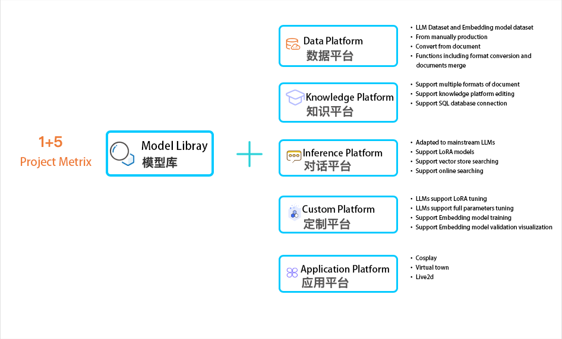

# 苏秦（suqin） WebUI integrated platform for LLMs

[**English**](./README_EN.md) | [**中文**](https://github.com/wpydcr/LLM-Kit)

## Introduction

⛓️ This project proposes to implement an WebUI integrated platform for latest LLMs, enable customized model and applications without coding!

Function Metrix shown as below：
<p align="center">
  
</p>

---

## Deployment
For beginners please refer to the [user manual](https://www.yuque.com/setpath/llm-kit).

### Tested Environment
The project has been tested under Python 3.8 - 3.10，CUDA 11.7/11.8, Windows、Linux system。

### Setup

#### 1. Get the environment

```shell
# Clone the repo
$ git clone https://github.com/wpydcr/LLM-Kit.git

# cd to the directory
$ cd LLM-Kit

# install requirements
$ pip install -r requirements.txt
```
 Or simply download：[Windows Env](https://pan.baidu.com/s/1dKMU4KN7qpB9kQ-Kxs57GA?pwd=yxr2)， [Linux Env](https://pan.baidu.com/s/1exSZYLSx0OWP5NXNwtZsCw?pwd=fhn0)。
 
 [GPU Driver](https://www.nvidia.cn/Download/index.aspx?lang=cn) and [cuda](https://developer.nvidia.com/cuda-toolkit-archive) is also required and should be pre-installed.

#### 2. Execute the script

+ For windows，double click web-demo.bat to run.

+ For Linux，double click web-demo.sh to run.

#### 3. Relavant pre-built content

+ To try LLM with MySQL database connected, please download [this](https://pan.baidu.com/s/13EWleDUaqHY7JeyfY0ErDQ?pwd=bjnp).

+ To try LLM with cosplay, please download [this](https://pan.baidu.com/s/13eWB-HMay7g9BSMIuZc8JQ?pwd=h9hq).

+ To try response with memes, please download [this](https://pan.baidu.com/s/1W2Rwq6Ies4VRxY7wsgkNVQ?pwd=lxmm).

---

## File Structure

- **env** ：Integrated Environment
- **utils** ：utils components
- **modules** ：code of modules
  - **agent** ：agent relevant code
    - **chatdb** : code for MySQL connection
    - **svc** : SVC code
    - **vits** : vits code
  - **apply** ：demo application code
  - **model** ：model code
- **data** ：general data
  - **apply** ：demo application data
    - **audio** ：generated audio
    - **emotion** ：memes used for LLM response
    - **play** ：cosplay character settings
  - **documents** ：Local knowledge vector store
  - **modeldata** ：model data for training
    - **LLM** ：LLM training data
    - **Embedding** ：Embedding model training data
- **ui** ：ui code
- **models** ：Model file
  - **LLM** ：LLM model file
  - **Embedding** ：Embedding model file  
  - **LoRA** ：LoRA model file
  - **live2d_models** ：[live2d model file](https://www.live2d.com/en/download/sample-data/)
  - **svc_models** ：svc models
    - **hubert_model** ：[voice decoder file](https://github.com/bshall/hubert/releases/download/v0.1/hubert-soft-0d54a1f4.pt)
    -  **svc** : svc model file
  - **vits_pretrained_models** : [vits model file]((https://huggingface.co/spaces/zomehwh/vits-models/tree/main/pretrained_models))

---

## Todo

- [x] LLM API support(no GPU)
  - [x] [openai(VPN)](https://platform.openai.com/account/api-keys)
  - [x] [azure openai](https://learn.microsoft.com/zh-cn/azure/cognitive-services/openai/)
  - [x] [文心一言](https://cloud.baidu.com/survey_summit/qianfan.html)
  - [x] [智谱GLM](https://open.bigmodel.cn/usercenter/apikeys)
  - [x] [通义千问](https://help.aliyun.com/document_detail/2399480.html?spm=5176.28197632.0.0.5cea7e06Uj4ELL)
  - [x] [讯飞星火](https://console.xfyun.cn/services/cbm)
- [ ] LLM support (train/inference)
  - [x] [THUDM/chatglm-6b](https://huggingface.co/THUDM/chatglm-6b)
  - [x] [fnlp/moss-moon-003-sft](https://huggingface.co/fnlp/moss-moon-003-sft)
  - [x] [FreedomIntelligence/phoenix-chat-7b](https://huggingface.co/FreedomIntelligence/phoenix-chat-7b)
  - [x] [JosephusCheung/Guanaco](https://huggingface.co/JosephusCheung/Guanaco)
  - [x] [baichuan-inc/baichuan-7B](https://huggingface.co/baichuan-inc/baichuan-7B)
  - [x] [THUDM/chatglm2-6b](https://huggingface.co/THUDM/chatglm2-6b)
  - [x] [internlm/internlm-chat-7b-8k](https://huggingface.co/internlm/internlm-chat-7b-8k)
  - [ ] [llama2]()
- [x]  finetune Support
  - [x] [LoRA](https://github.com/tloen/alpaca-lora)
  - [x] <del>[P-Tuning](https://github.com/THUDM/ChatGLM-6B/tree/main/ptuning)<del>
  - [x] Full Parameter finetune
- [x] Embedding support trainning(train,inference:models that can be loaded by the HuggingFaceEmbeddings)
  - [x] [Models constructed by BERT,SENTENCEBERT and COSENT](https://github.com/shibing624/text2vec#evaluation)
    - [x] [shibing624/text2vec-base-chinese](https://huggingface.co/shibing624/text2vec-base-chinese)
    - [x] [bert-base-uncased](https://huggingface.co/bert-base-uncased)
    - [x] [paraphrase-multilingual-MiniLM-L12-v2](https://huggingface.co/sentence-transformers/paraphrase-multilingual-MiniLM-L12-v2)
- [ ] Tools
  - [ ] Dataset
    - [x] LLM Training dataset make
    - [x] Embedding Training dataset make
    - [x] LLM Dataset conversion
    - [x] Embedding Dataset conversion
  - [ ] langchain
    - [x] Local Knowledge base
      - [x] FAISS
    - [x] Internet connection
    - [x] [mysql database connection](https://github.com/huchenxucs/ChatDB)
    - [x] Agent implement
  - [ ] Plugin model
- [ ] Application demo
    - [x] Cosplay
        - [x] Memory Bank
        - [x] Background Bank
        - [x] Characteristics Prompt
        - [x] Time perception
        - [x] [Memes](https://pan.baidu.com/s/1BqO0x8EKV6LlP2MSOz8CDA?pwd=2jpp)
    - [ ] generative-agents
        - [ ] Single-Agent Design
        - [ ] scenes  Setting
        - [ ] AI Interactive
        - [ ] Visualization
    - [ ] Character
        - [ ] Voice
            - [x] [Online tts](https://fanyi.baidu.com/)
            - [X] [Local tts](https://github.com/jackiexiao/zhtts)
            - [X] [vits Call](https://huggingface.co/spaces/zomehwh/vits-models/tree/main/pretrained_models)
            - [ ] [vits Train](https://github.com/SayaSS/vits-finetuning)
            - [X] [svc Call](https://github.com/LC1332/Chat-Haruhi-Suzumiya)
            - [ ] [svc Train](https://github.com/svc-develop-team/so-vits-svc)
        - [ ] Mouth Synchronize
            - [x] [live2D](https://www.live2d.com/en/download/sample-data/)
            - [ ] real person
        - [ ] Emotion
        - [ ] movement
        - [ ] Field
- [ ] Add API Support
  - [ ] Deploy API by fastapi
  - [ ] Implement WEB UI Demo by API call
  - [ ] VUE Webui

---

## Contributors

### [吴平宇 @君材数云](https://github.com/wpydcr)
Initiator, responsible for overall project architecture and technical planning

### [廖文彬 @中科院计算技术研究所](https://github.com/set-path)
Responsible for python development of gradio, database, api interface integration, etc.

### [胡钜程 @伦敦大学学院UCL](https://github.com/smgjch)
Responsible for python development for live2D, voice, gradio, etc.

### [李璟辉](https://github.com/JaheimLee)
Responsible for back-end development of LLM training and inference

### [从灿](https://github.com/Alan-2018) 
Responsible for back-end development of embedded model training


---

## Project Recruitment

For details, see [user manual](https://www.yuque.com/setpath/llm-kit/gf3hu8l2bys1pgfd)

---

## Reference

  [基于ChatGLM的langchain应用](https://github.com/imClumsyPanda/langchain-ChatGLM)

  [骆驼中文大模型](https://github.com/LC1332/Luotuo-Chinese-LLM)

 [ChatDB](https://github.com/huchenxucs/ChatDB)

  [Live2d模型](https://github.com/nladuo/live2d-chatbot-demo)

 [Chat-Haruhi-Suzumiya](https://github.com/LC1332/Chat-Haruhi-Suzumiya)

 [川虎Chat：为多种LLM提供Web图形界面](https://github.com/GaiZhenbiao/ChuanhuChatGPT)

---

## License
The code in this repository is open source according to the [AGPL-3.0](https://www.gnu.org/licenses/agpl-3.0.en.html) protocol.

On the one hand, we hope to strengthen the productisation of the project through open source; on the other hand, we hope to absorb more practice scenarios in the community to continue to improve the product, and we welcome everyone to participate in the project.

AGPL-3.0 is an OSI-approved licence, which meets all the standards of free and open source software. Open source will always be the core of our heart and soul, and we will always insist on doing this, and we believe that with the impetus of the community, we will definitely do a better job in this matter.

Many developers may have questions about this protocol, but the open source community has a lot of open source software that uses the AGPL-3.0 protocol, such as MongoDB, Grafana, Loki, and so on, and Wikipedia has a list of open source projects that use the AGPL-3.0 open source protocol.

AGPL-3.0 agreement has a very key point, that is, the modification of the upstream open source project code after the secondary distribution of the version must also be open source, the agreement restricts the part of the enterprise wants to Folk open source project code after the closed-source commercial distribution, and the upstream open source project maintenance team for direct commercial competition, if only the enterprise's own internal use without any level of modification, the user can not worry about the AGPL-3.0 agreement. Users do not have to worry about the restrictions imposed by the AGPL-3.0 agreement, which is designed to encourage and enable third parties who modify the software to contribute to the project and the community. We think this is a fairer way forward, and we believe it will help us build a stronger community.

Simply put: if you modify the source code of the project, you must contribute those modifications to the community, and you will not be allowed to distribute or sell the modified or derived code as closed-source commercial software.

We also offer a commercial licence, so if you need to develop, change or use this product in any way that is commercially viable, please contact us (wupingyu@jc-data.cn) for a commercial licence to comply with the AGPL-3.0 agreement for your use.

In addition, we also accept customised development according to individual or corporate needs.

Currently in China, the GPL agreement has the characteristics of a contract, which is a kind of civil legal act and falls within the scope of China's Contract Law. The project team reserves the right to litigation.

The project open source team has the final interpretation of this open source agreement.

---

## How to cite


Please cite the repo if you use the data or code in this repo.

```
@misc{wupingyu2023,
  author={Pingyu Wu},
  title = {LLM Kit},
  year = {2023},
  publisher = {GitHub},
  journal = {GitHub repository},
  howpublished = {\url{https://github.com/wpydcr/LLM-Kit.git}},
}
```

---

## Starchart

[](https://star-history.com/#wpydcr/LLM-Kit&Date)
